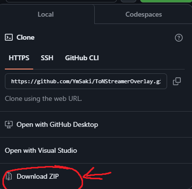
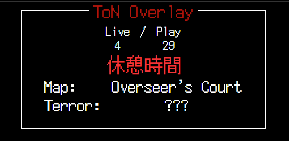

# Terror Of Nowhere 配信用情報表示オーバーレイ
## どうやって入れればいい？
### 方法1
ダウンロードしたい場所で以下のコマンドを実行

> ```
> git clone https://github.com/YmSaki/ToNStreamerOverlay.git
> ```

※) 要git

### 方法2
Zipでダウンロード



## 何が必要？
ToN Save Manager<br>
⇒設定からWebSocket APIサーバーを有効にしてね。

## 何が表示される？
### ToN Overlay

### RoundTracker

